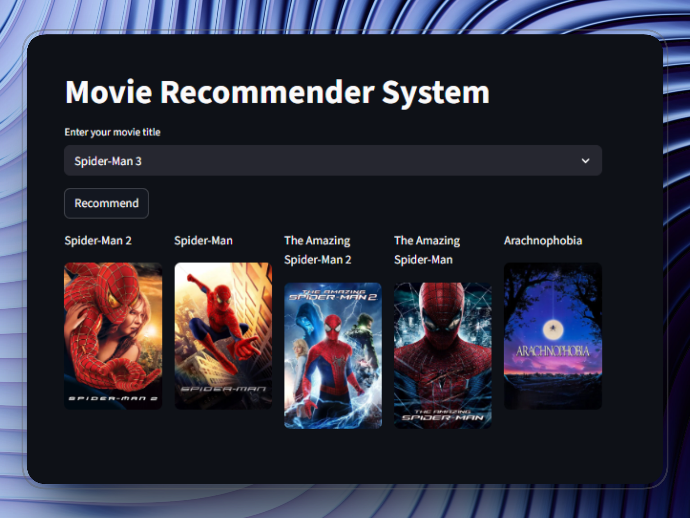

# Movie Recommendation System

## What it does

* You select a movie
* The app suggests similar movies
* Recommendations are based on cosine similarity



---

## 🛠️ Built with

* Python
* Pandas, NumPy
* Scikit-learn
* Streamlit

---

## 🛠 Run Locally

1. **Clone the repo**

```bash
git clone https://github.com/AaqibZahid/movie-rs-content-based.git
cd movie-rs-content-based
```

2. **Install dependencies**

```bash
pip install -r requirements.txt
```

3. **Download `similarity.pkl`**

* Get it from the latest GitHub release:
  [Download similarity.pkl](https://github.com/AaqibZahid/movie-rs-content-based/releases/download/v1.0/similarity.pkl)
* Place it inside the project folder:

```
movie-rs-content-based/
├─ app.py
├─ movies.pkl
├─ similarity.pkl   <- place it here
└─ ...
```

4. **Run the app**

```bash
streamlit run app.py
```

5. **Open the app in your browser**

* Streamlit will usually open: `http://localhost:8501`
* Select a movie and click **Recommend** to see recommendations with posters.

---

The app should open in your browser automatically.

---
